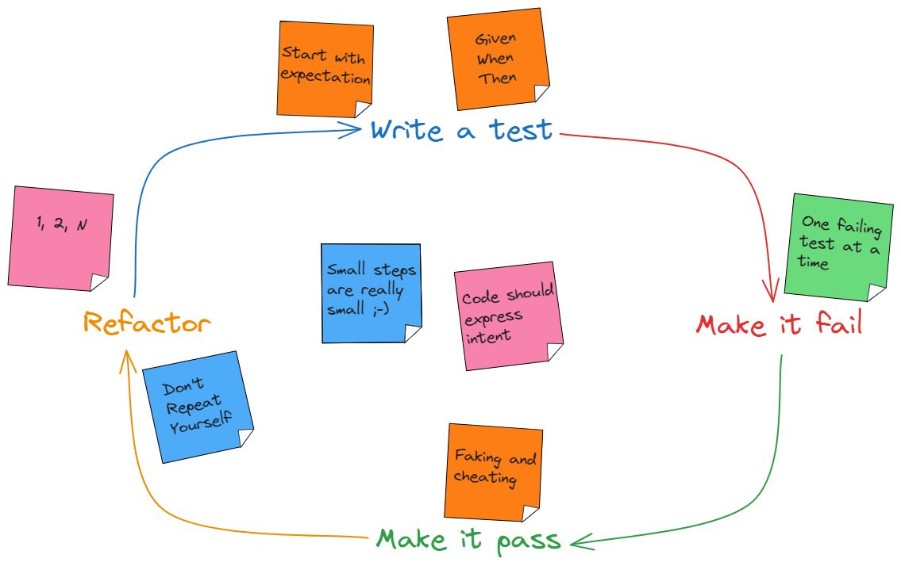
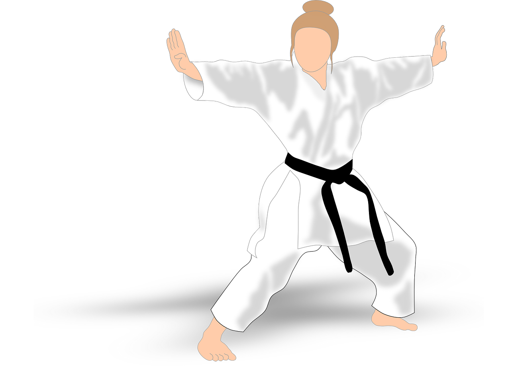
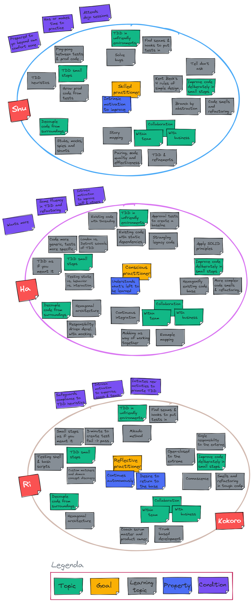
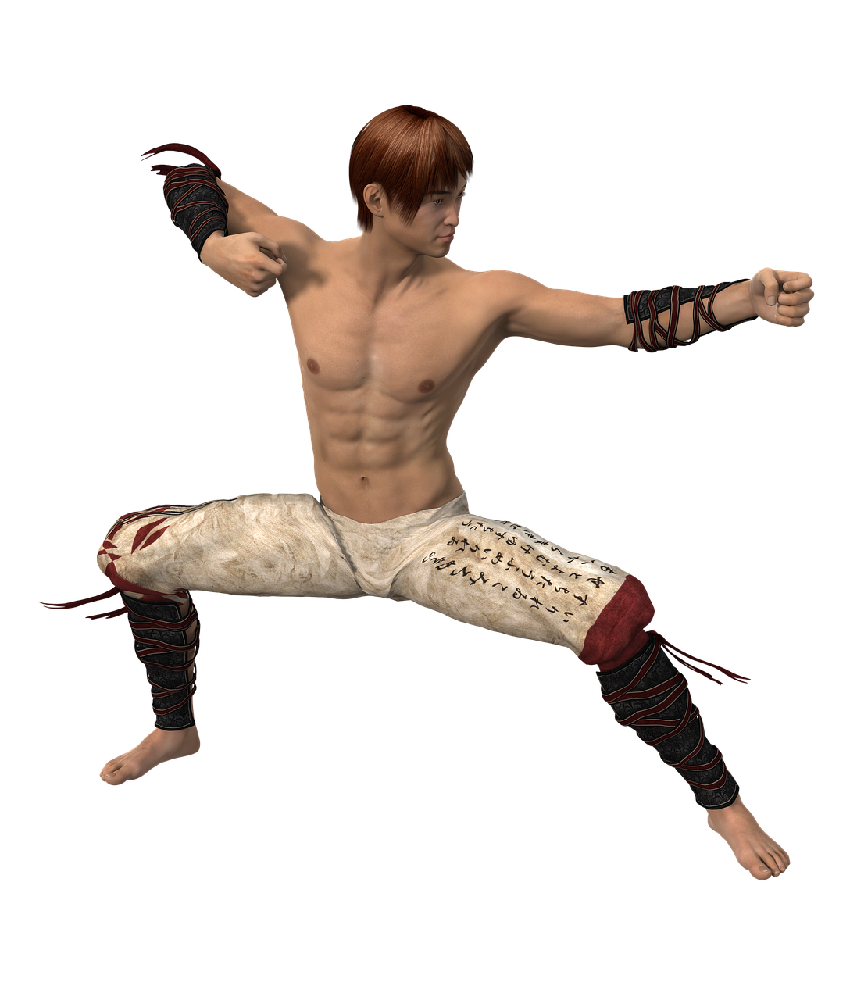

# Test-driven development materials

[TDD](https://semaphoreci.com/blog/test-driven-development)
entails so much more than the well-known but trite red-green-refactor phrase.
More accurately, it is a great form of _deliberate practice_, in which a set of
**skills, principles, and [heuristics](https://www.qwan.eu/2021/10/13/what-is-a-heuristic.html)** 
are continually combined [to build quality in](https://confluxbooks.com/books/build-quality-in).

Last but not least, TDD is a lot of fun. You have arrived at the right
place to learn everything about it and to get you up and running
in the wink of an eye!

###  Level up your TDD skills

Please consult the [readme in the tdd-katas folder](./tdd-katas/README.md)
to learn more about which katas address which topics at which difficulty 
level and how they relate to the 
[24 key capabilities to drive improvement in software delivery](https://itrevolution.com/articles/24-key-capabilities-to-drive-improvement-in-software-delivery/).

### Coaching

These materials may seamlessly be incorporated into 
[the Samman coaching method](https://www.sammancoaching.org/) and
are ready to be used in cloud development environments (CDEs) such
as [replit.com](https://replit.com), 
[GitHub Codespaces](https://github.com/features/codespaces), 
or [gitpod.io](https://gitpod.io)

# Contents

This repository contains materials to both practice as well as to teach TDD
in the form of courses, workshops, and/or coding dojos.

Click for a detailed description of the contents of this repository

  
- **[cookiecutter](./cookiecutter/)** &rarr; [cookiecutter](https://github.com/cookiecutter/cookiecutter) templates for starting a kata in various languages
- **[docs](./docs/)** &rarr; additional free books
- **[kata-solutions](./kata-solutions/)** &rarr; (multiple) solutions in multiple languages for almost all katas, with recently an emphasis on functional programming
- **[presentations](./presentations/)** &rarr; [reveal-md](https://github.com/webpro/reveal-md) TDD presentations
- **[tdd-katas](./tdd-katas/)** &rarr; TDD katas
  - **[README.md](./tdd-katas/README.md)** &rarr; with a table that lists per kata both a course-grained difficulty as well as a list of aspects that are addressed
  - **a-kata-name** &rarr; katas in various languages such as Python, Java, Javascript, Kotlin, and Clojure with both a general introduction in the readme files as well as detailed instruction files per kata per language
- **[tools](./tools/)** &rarr; playgrounds for getting acquainted with tools, libraries, and frameworks such as [approval testing](https://approvaltests.com/)

# About coding katas

> Japanese culture influenced a lot of software and project management fields. 
> Concepts like [Lean](https://apiumhub.com/?p=55302), [Kata](https://apiumhub.com/?p=4044), etc 
> has come from Japan. And we should admit, that they have improved the existing processes, 
> increasing efficiency and satisfaction overall &#8212; [apiumhub.com](https://apiumhub.com/tech-blog-barcelona/code-kata/)

With the materials in this repository, you'll learn TDD by practicing 
so-called [coding katas](https://apiumhub.com/tech-blog-barcelona/code-kata/):

> A kata is an exercise in karate where you repeat a form many, many times, making little improvements in each. 
> The intent behind code kata is similar &#8212; [codekata.com](http://codekata.com/) 

Generally speaking, each kata tries to target one or more skills, 
and this collection is no exception to that general rule. As the saying goes, 
practice makes perfect, and the same holds for (coding) katas: preferably 
you make them your own by repeating them _time and again_.

And although the saying goes that practice makes perfect, the reality is 
that code almost never reaches a perfect state: you can always find ways to 
further improve your code and your skill(s). There are always new ways to become 
more proficient and faster. Luckily, it turns out that mastery is one of
[the three primary drivers that keep us motivated](https://www.youtube.com/watch?v=u6XAPnuFjJc). 
Moreover, the payoff of mastering TDD is much higher than the investments that you'll put in. 

After spending a certain time with TDD, people claim that there is no 
other way to develop software. It is almost a learning to type with ten 
fingers: once you master the skill, you wonder how you ever managed without it.

# Coding dojo

A dojo is a place for immersive learning. Needless to say, coding dojos are meant to 
eventually thoroughly master TDD using coding katas as a means. During the coding dojos, 
TDD practitioners get to know, apply, and practice all TDD skills, heuristics, and principles. 

Moreover, during the dojos practitioners are made acquainted with various aspects of 
[pair-programming](https://martinfowler.com/articles/on-pair-programming.html) 
as well as various 
[mob-programming](https://mobprogramming.org/mob-programming-basics/) 
concepts such as randori, driver-navigator, etc.

During these sessions, we may envision practitioners going roughly speaking through a set of 
learning phases. Departing from an initial skilled practitioner, they gradually move up to a 
conscious practitioner and may finally eventually reach the skills of a so-called reflective 
practitioner. As such, the phases are quite comparable to the well-known 
[randori](https://codingdojo.org/practices/RandoriKata/), driver-navigator, etc.
stages of learning.

During each of these learning stages, more or less the same set of topics are practiced, 
but gradually more and more in-depth. For example, such topics include TDD in unfriendly 
environments, decoupling code from surroundings, deliberately improving code in small steps, etc.
This concept is elaborated in the pictures below.

# Expected background

So which background do we expect from practitioners in a dojo? First
and foremost a mindset to always want to improve and learn is the most
the valuable thing any participant can bring to the table!

Also, some of the most obvious questions that may come to mind 
are answered below.

### What general programming skills are required?

These katas are intended for people who want to learn TDD. Some basic programming experience is required, 
such as knowing what a class is, what an object is, what a primitive is, what exception handling 
entails, and how to write conditionals and loops. 

Although not strictly required, it will also definitely help if you are already familiar with concepts such as 
[encapsulation](https://en.wikipedia.org/wiki/Encapsulation_(computer_programming)) and the 
[single responsibility principle](https://en.wikipedia.org/wiki/Single-responsibility_principle).

### Is there a preferred programming language?

No, there isn't. There are cookie-cutter templates for many languages available,
but even if there aren't any for your favorite programming language, you can still
do many of the katas. Moreover, the programming language is kind of irrelevant for
practicing the various aspects that are being addressed. I have facilitated 
many [coding dojos](https://codingdojo.org/WhatIsCodingDojo/) where multiple participants were exposed to 
e.g. Python for the first time, and they managed pretty soon pretty well.

# About the author

My name is [Zeger Hendrikse](https://www.linkedin.com/in/zegerhendrikse/). I am a self-employed IT consultant. I'm a fan of [extreme programming](https://en.wikipedia.org/wiki/Extreme_programming), [continuous delivery](https://www.continuousdelivery.com/), and [DevOps](https://cloud.google.com/devops) / [DORA](https://www.devops-research.com/research.html). 

This means my heroes are [Dave Farley](https://www.davefarley.net/), [Robert C. Martin](http://blog.cleancoder.com/) (aka Uncle Bob), [Martin Fowler](https://martinfowler.com/), [Kent Beck](https://www.kentbeck.com/)... just to name a few.

I decided to share one of my passions with all of you here: TDD (test-driven development)!

## Contact

Feel free to contact me at: **zeger** _&lt;dot&gt;_ **hendrikse** _&lt;at&gt;_ **gmail** _&lt;dot&gt;_ **com** for e.g.:
- Feedback and suggestions
- Offering any of the katas in other languages than offered here
- Facilitating a course and/or [coding dojos](https://codingdojo.org/WhatIsCodingDojo/), where apprentices can practice [katas](http://codekata.com/) together (with me as sensei 😉).

## Credits

Pictures in this repo are legally taken from [pixabay.com](https://pixabay.com). 

## License

  
Shield: [![CC BY-SA 4.0][cc-by-sa-shield]][cc-by-sa]

This work is licensed under a
[CC-BY-SA-4.0 license](https://creativecommons.org/licenses/by-sa/4.0/). Attribution: [github.com/zhendrikse/tdd](https://github.com/zhendrikse/tdd).

[![CC BY-SA 4.0][cc-by-sa-image]][cc-by-sa]

[cc-by-sa]: http://creativecommons.org/licenses/by-sa/4.0/
[cc-by-sa-image]: https://licensebuttons.net/l/by-sa/4.0/88x31.png
[cc-by-sa-shield]: https://img.shields.io/badge/License-CC%20BY--SA%204.0-lightgrey.svg
