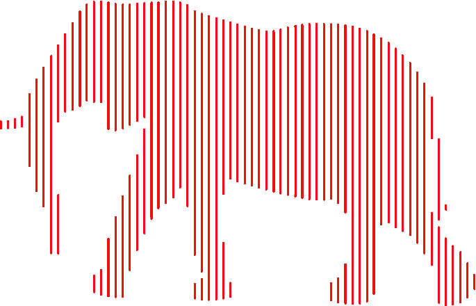
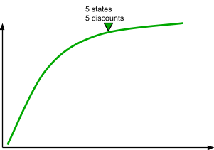

<!-- .slide: data-background="./images/elephant.png" width="50%" height="50%" -->

&nbsp;

&nbsp;

# Elephant Carpaccio kata

&nbsp;

&nbsp;

### by [Zeger Hendrikse](https://www.it-essence.nl/)

&nbsp;

#### Credits: Alistair Cockburn, Hendrik Kniberg, Michael Wallace

&nbsp;

---

- <!-- .element: class="fragment" --> 
  Splitting user stories vertically
- <!-- .element: class="fragment" --> 
  Value of splitting user stories
- <!-- .element: class="fragment" --> 
  Software delivery value curve
- <!-- .element: class="fragment" --> 
  Hands-on practice and retrospective

&nbsp;

&nbsp;

&nbsp;

---

## About ...

- Elephant Carpaccio kata
  - <!-- .element: class="fragment" --> 
    Alistair Cockburn, minor mods by Henrik Kniberg
  - <!-- .element: class="fragment" --> 
    Practice and learn thin slicing
    - size ~ 1-week to 1-day requests
    - from the perspective of the business
  - <!-- .element: class="fragment" --> 
    Experienced teams: all user stories &lt;= 1 day 
  - <!-- .element: class="fragment" --> 
    Metaphor: huge elephant ==&gt; tiny sliced stories

---

## Good user stories

- [INVEST](https://www.agilealliance.org/glossary/invest/)
  - <!-- .element: class="fragment" --> 
    “I” ndependent (of all others)
  - <!-- .element: class="fragment" --> 
    “N” egotiable (not a specific contract for features)
  - <!-- .element: class="fragment" --> 
    “V” aluable (or vertical)
  - <!-- .element: class="fragment" --> 
    “E” stimable (to a good approximation)
  - <!-- .element: class="fragment" --> 
    “S” mall (so as to fit within an iteration)
  - <!-- .element: class="fragment" --> 
    “T” estable (in principle, even if there isn’t a test for it yet)

---

## How big are your stories

- Target
  - <!-- .element: class="fragment" --> 
    Story = a few days
  - <!-- .element: class="fragment" --> 
    Task = a few hours
  - <!-- .element: class="fragment" --> 
    Commit = several times per hour

---

## Why split stories

- Discuss in teams (5 minutes)

----

- Example outcomes:
  - <!-- .element: class="fragment" --> 
    Learn faster
  - <!-- .element: class="fragment" --> 
    Deliver more often
  - <!-- .element: class="fragment" --> 
    Happier stakeholders
  - <!-- .element: class="fragment" --> 
    Better synchronization with other people and teams (testing)
  - <!-- .element: class="fragment" --> 
    Better prioritization
  - <!-- .element: class="fragment" --> 
    Better product earlier
  - <!-- .element: class="fragment" --> 
    More business options
  - <!-- .element: class="fragment" --> 
    Less risk (less time “under water”)
  - <!-- .element: class="fragment" --> 
    Sense of velocity
  - <!-- .element: class="fragment" --> 
    Easier planning
  - <!-- .element: class="fragment" --> 
    Less risk of carryover

---

## Software delivery value curve

---

## User story splitting 

- <!-- .element: class="fragment" --> 
  Split by
  - capabilities offered
  - user roles / user personas
  - target device
  - CRUD boundaries
  - Happy path/other paths
- <!-- .element: class="fragment" --> 
  Zero/One/Many approach
- <!-- .element: class="fragment" --> 
  Scope: walking skeleton

---

## The kata

- Assignment
  - Create +/- 15 user stories for a simple application
  - Extremely thin slices, but each is elephant-shaped

 <!-- .element width="50%" height="50%" -->

---

## The Product

- Build a retail calculator app
  - Inputs:
    - How many of an item
    - Price per item
    - 2 letter state code for calculating sales tax
  - Output:
    - Total price of order
    - Includes discount based on order value and sales tax

---

## Priorities

---

## Priorities
