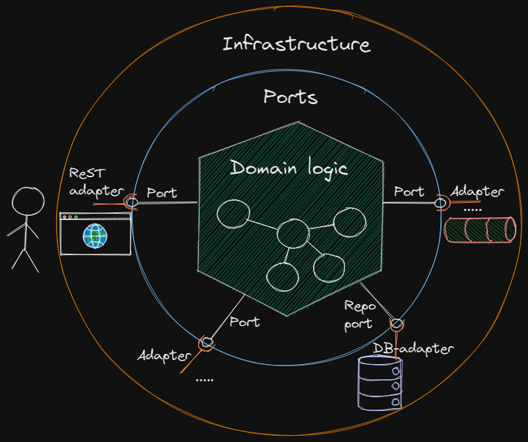

# Introduction

This is a kata designed to teach you how to keep your system under 
development properly testable when dealing with interactions with 
external systems, in this case REST endpoints and a database using
[the ports &amp; adapter architecture and dependency inversion](https://github.com/zhendrikse/tdd/wiki/Hexagonal-Architecture).

In this kata we are going to build a very basic REST API that 
fetches employee data from a database and stores these data 
into a database.

This kata shows how to drive the realization of this application
from the inside out, rather than starting from the external data provider 
by first focusing on the domain logic. Next, we will define  
the ports and adapters. 

# How to deal with external systems

In this module we are going to build a very basic REST API that fetches employee data from a database and stores these data into a database.

Note that the above lay-out can be seen as a simplification of the aforementioned hexagonal architecture:

As the domain logic will (almost) be absent in this kata, this implies we can simplify the picture of the hexagonal architecture as shown in the first picture. Note that normally this will almost never be the case, but the purpose of this exercise is to learn how to implement an adapter, not (even some simple form of) a [domain model](https://matfrs2.github.io/RS2/predavanja/literatura/Avram%20A,%20Marinescu%20F.%20-%20Domain%20Driven%20Design%20Quickly.pdf). 

So summarizing, we are going to focus on how to deal with test doubles and external systems, in this case a database. 

# The kata

In this kata, we are going to implement the following endpoints:

