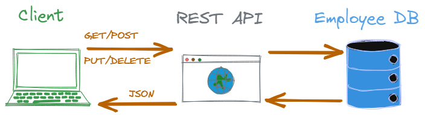

# Introduction

This is a kata designed to teach you how to keep your system under 
development properly testable when dealing with interactions with 
external systems, in this case REST endpoints and a database using
[the ports &amp; adapter architecture and dependency inversion](https://github.com/zhendrikse/tdd/wiki/Hexagonal-Architecture).

In this kata we are going to build a very basic REST API that 
fetches employee data from a database and stores these data 
into a database.

This kata shows how to drive the realization of this application
from the inside out, rather than starting from the external data provider 
by first focusing on the domain logic. Next, we will define  
the ports and adapters. 

# The kata

In this kata, we are going to implement the following endpoints:

