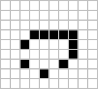

| Pulsar | Glider | Spaceship |
| ------ | ------ | --------- |
|  |  |  | 

# Game of Life

This kata is meant to experiment with different implementations
of [Conway's game of life](https://en.wikipedia.org/wiki/Conway%27s_Game_of_Life).

## Available variants

| Directory                                      | Description |
| ---------------------------------------------- | ----------- |
| [game-of-life-python](./game-of-life-python)   | A straight forward object oriented solution in Python |
| [game-of-life-java](./game-of-life-java)       | A strictly _functional_ solution in Java                     |
| [game-of-life-clojure](./game-of-life-clojure) | A strictly _functional_ solution in Clojure            |

In addition, one may play with the boundary conditions:

- Implement a game with finite boundaries
- Implement a game where both the left and right as well as the top and bottom boundaries are glued together
- Implement a game without boundaries, i.e. an infinite playfield

# References

- [Functional solutions](http://programmablelife.blogspot.com/search/label/conways-game-of-life) to Game of Life
