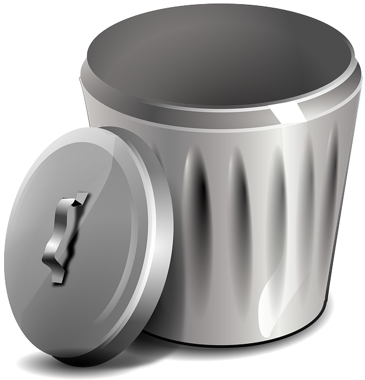
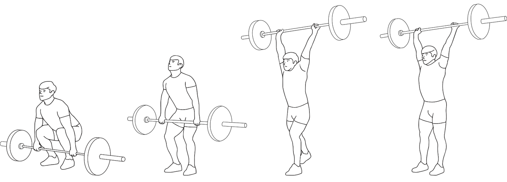

# Refactoring the Gilded Rose

In the previous module, we have created a golden master/snapshot of the code as-is. Before we start (or even can start) extending the functionality, let's first clean up the mess by applying some well-known refactoring techniques. 



We will use our golden master as a safety net. 

### Tip

Before starting this unit, check out [the refactoring Guru](https://refactoring.guru/refactoring) or [sourcemaking.com](https://sourcemaking.com/refactoring) for some background on code smells and how to address them using frequently used refactoring patterns. For this kata, the simplication of conditionals is of special interest, of course!

## Extract method

The purpose of [extract method](https://wiki.c2.com/?ExtractMethod) is to move a fragment of code into a method which name explains the purpose of that piece of code, e.g.:

```python
def update_quality(self):
  for item in self.items:
    self.update_item_quality(item)
```

### Exercise I

Apply this to the code base, in steps as small as possible, while continuously verifying the test is still green (&lt;ctrl&gt;-&lt;enter&gt; is your friend).

## Refactor Negate If

Code becomes better readable by flipping negated if-statements into their positive counterparts: [refactor Negate If](https://wiki.c2.com/?RefactorNegateIf).

### Exercise II

Eliminate the negation and "flip" the conditional:

```python
if item.name == "Aged Brie" or item.name == "Backstage passes to a TAFKAL80ETC concert":
```

Verify the test is still green (&lt;ctrl&gt;-&lt;enter&gt; is your friend).

## Lift-up conditional


Let's apply the lift-up conditional refactoring to disentangle
the complicated if-statements. In the next exercise, you are guided through the lift-up conditional refactoring technique step by step.

As this technique allows us to disentangle complex conditionals in such small steps, it is an indispensible skill to acquire.

### Exercise III

First step is to move _all the logic beloging_ to one particular method contaning the complex conditional(s) into a temporary method `foo(self, item)`:

```python
def update_item_quality(self, item):
  self.foo(item)

def foo(self, item):
  if item.name == "Aged Brie" or item.name == "Backstage passes to a TAFKAL80ETC concert":
  ...
```

Next, add the following trivial conditional (and verify the test still works!):

```python
def update_item_quality(self, item):
  if item.name == "Aged Brie":
    self.foo(item)
  else: 
    self.foo(item)
```
Next, inline the logic of `foo()`. Yes, you read that correctly, we are going to copy and paste _all the logic_ of `foo()` back into _both_ branches of the if-statement! Of course, the `foo()` can now be removed.


### Exercise IV

Run the test and inspect the code coverage report. 
- What catches the eye?
- Remove _all_ dead code (that's colored red) in _small steps_. Verify if the test(s) are still green after _every_ little change you make!
- Inspect the branch coverage (that's colored yellow)
  - Hover over the yellow-colored conditionals to see which branch of the conditional is uncovered.
  - Take out branches that are not reached: the hover-over gives you hints which branches are never reached!
- Finally, take out "Agred Brie" from `else`-clause of the `if item.name == "Aged Brie":`, as we know that we are in the branch of the conditional where the item name is _not_ "Aged Brie".


Continue to the next exercise only when test coverage is back to 100%, so all lines are green.

### Exercise V 

Let's apply the lift-up conditional refactoring once more by applying it to the else-branch of item name equals "Aged Brie". Move all the logic beneath the else-branch to a `foo(self, item)` so that the code becomes:

```python
else:
  if item.name == "Backstage passes to a TAFKAL80ETC concert":
    self.foo(item)
  else:
    self.foo(item)
```

Check the tests are still green, inline the code, run the tests again and then repeat the same steps as above to clean up the unreachable code and branches of the conditionals.

### Exercise VI 

Let's apply the lift-up conditional refactoring for the last time by applying it to the `else`-branch of "Backstage passes to a TAFKAL80ETC concert"

```python
else:
  if item.name == "Sulfuras, Hand of Ragnaros":
    self.foo(item)
  else:
    self.foo(item)
```

Remove the dead code and branches again in small steps.

### Exercise VII

Rearrange item type conditional

```python
if item.name == "Aged Brie":
  ...
elif item.name == "Backstage passes to a TAFKAL80ETC concert":
  ...
else:
  if item.name != "Sulfuras, Hand of Ragnaros":
    ...
```


### Exercise VIII

[Refactor Negate If](https://wiki.c2.com/?RefactorNegateIf) in small steps to arrive at:

```python
if item.name == "Aged Brie":
  ...
elif item.name == "Backstage passes to a TAFKAL80ETC concert":
  ...
elif item.name == "Sulfuras, Hand of Ragnaros":
  pass
else:
  ...

```

## Intermezzo

Note that now the logic has nicely been isolated for each item type, the next logical step wolud be to replace the conditional separating the logic by item type by polymorphism. We are going to do that by [replacing conditional with polymorphism](https://refactoring.guru/replace-conditional-with-polymorphism).

## Introducing polymorphism

### Exercise IX 

Extend the item class with an update method that first only contains the logic to update "Aged Brie" (where we have streamlined some increment and decrement statements):

```python
...
def update_quality(self):
  if self.name == "Aged Brie":
    if self.quality < 50:
      self.quality += 1
    self.sell_in -= 1
    if self.sell_in < 0:
      if self.quality < 50:
        self.quality += 1
```

Check everything is green, and then replace the logic in the conditional by:

```python
...
if item.name == "Aged Brie":
  item.update_quality()
``` 

Cehck everything is still green and then do the same for "Backstage passes to a TAFKAL80ETC concert", i.e. extend the `update_quality` method in the item class with an additional conditional for "Backstage passes to a TAFKAL80ETC concert", so that we get

```python
...
if item.name == "Aged Brie":
  item.update_quality()
elif item.name == "Backstage passes to a TAFKAL80ETC concert":
  item.update_quality()
``` 

Repeat the same steps for the other items, so that we arrive at:

```python
if item.name == "Aged Brie":
    item.update_quality()
elif item.name == "Backstage passes to a TAFKAL80ETC concert":
    item.update_quality()
elif item.name == "Sulfuras, Hand of Ragnaros":
    item.update_quality()
else:
    item.update_quality()
```

Obviously, this can be simplified by removing the if-statement alltogether:

```python
    def update_quality(self):
        for item in self.items:
            item.update_quality()

```

### Exercise X

Let's now create the polymorphic subclasses one by one:

```python
class AgedBrie(Item):
  def __init__(self, name, sell_in, quality):
    self.name = name
    self.sell_in = sell_in
    self.quality = quality

  def update_quality(self):
    if self.quality < 50:
      self.quality += 1
    self.sell_in -= 1
    if self.sell_in < 0:
      if self.quality < 50:
        self.quality += 1
```
We have to modify the code in `gilded_rose_test.py` accordingly:

```python
...
def do_update_quality(self, name: str, sellIn: int, quality: int) -> str:
  if name == "Aged Brie":
    items = [AgedBrie(name, sellIn, quality)]
  else:
    items = [Item(name, sellIn, quality)]
```
Complete all the other item subclasses similarly but leave the default (no special items) update behaviour in the item base class. This then results in the following code in the test class:

```python
def do_update_quality(self, name: str, sellIn: int, quality: int) -> str:
  if name == "Aged Brie":
    items = [AgedBrie(name, sellIn, quality)]
  elif name == "Backstage passes to a TAFKAL80ETC concert":
    items = [BackstagePassesTafka(name, sellIn, quality)]
  elif name == "Sulfuras, Hand of Ragnaros":
    items = [Sulfuras(name, sellIn, quality)]
  else:
    items = [Item(name, sellIn, quality)]
```

### Exercise XI

As each item class knows its own name, it is no longer necessary to pass the name parameter on in the constructor:

```python
class AgedBrie(Item):
  def __init__(self, sell_in, quality):
    super().__init__("Aged Brie", sell_in, quality)
``` 
Carry this through for all item subclasses similarly.

### Exercise XII

Look for any further improvements/simplifications that you see fit and may want to make! For example, you may have already noticed this statement:

```python
item.quality = item.quality - item.quality
```

Obviously, this can/should be simplified!

#### Recommendation 

The code really improves further by applying the [primitive obsession](https://refactoring.guru/smells/primitive-obsession) refactoring pattern to at least the quality. Create a quality class, that has decrement and increment methods, so that it acts as a safeguard that the quality does not go below zero nor above its maximum threshold of 50.