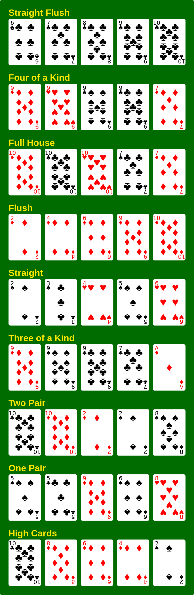

# Poker hands kata

The goal of this kata is to determine the best hand out of a set of hands
containing a set of poker cards (i.e. 5 cards).

This is a TDD version of the course [Design of Computer Programs](https://www.udacity.com/course/design-of-computer-programs--cs212) by [Peter Norvig](https://en.wikipedia.org/wiki/Peter_Norvig), which happens to use the poker hands kata as well! 

The approach is outside-in, also known as the [London school of TDD](https://blog.devgenius.io/detroit-and-london-schools-of-test-driven-development-3d2f8dca71e5) (or [mockist](https://martinfowler.com/articles/mocksArentStubs.html)) approach, the essence of which is to work our way from the outside inwards. So we start with a function to pick the winning hand among a set of hands, mocking the ranking function we need to make this happen. Next we implement the ranking of a hand, mocking all the functions we need to make that happen, etc. This way, our design will benefit from this approach, as we will see. 

For technicall details, you may want to refer also to [Test-Driven Development With Python: An Introduction to Mocking](https://medium.com/geekculture/test-driven-development-with-python-an-introduction-to-mocking-8ab6c1fe1c83).

## Rules

A poker deck contains 52 cards - each card has a suit which is one of clubs, diamonds, hearts, or spades (denoted C, D, H, and S in the input data).

Each card also has a value which is one of 2, 3, 4, 5, 6, 7, 8, 9, 10, jack, queen, king, ace (denoted 2, 3, 4, 5, 6, 7, 8, 9, T, J, Q, K, A).

For scoring purposes, the suits are unordered while the values are ordered as given above, with 2 being the lowest and ace the highest value.

A poker hand consists of 5 cards dealt from the deck. Poker hands are ranked by the following partial order from highest to lowest.

Source: [Door Sissyneck op de Engelstalige Wikipedia, CC BY-SA 3.0](https://commons.wikimedia.org/w/index.php?curid=12387417)

