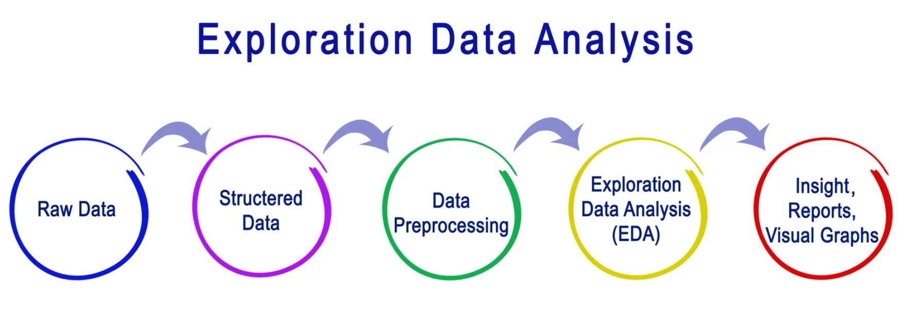

# Introduction questionnaire kata

This kata practises Exploratory Data Analysis (EDA) based on 
[a questionnaire](questionnaire.md) sent out to
train passengers in the Netherlands to get more insight
into the level of sustainability of their travels from
door-to-door.

In this kata we will practice TDD for some of the steps 
that are frequently encountered in a data analysis flow.

## Connection to well-known steps in data analysis 

Let's see how the above steps are applied in this kata:

1. **Raw data**: 
   We start with a raw data/excel file containing the answers to the questions in 
   [a survey that's _very similar_ to this one](questionnaire.md). 
   These data need to be converted 
   into a format (dataframes), in order to facilitate further data processing.
2. **Structured data**: 
   The raw data coming from the excel file is still unstructured. A couple of additional
   steps may be required to structure these data so that they can be analyzed. 
   
   In this kata we will need to cleanse some text from numerical columns and make
   a selection from all the responses that allows us to focus on our interest(s),
   namely the sustainability of the door-to-door travel made by passengers.
3. **Data preprocessing**: Data preprocessing is an important step in the data mining process 
   that involves cleaning and transforming raw data to make it suitable for analysis. 
   
   We will need to combine some columns. 
4. **EDA**: Using EDA we can discover some trends or patterns present in the dataset.
   In this kata we mainly focus on the sustainability of that part of the journey that 
   passengers make to get to the train station.
5. **Insights/reports/graphs**: As there are quite some libraries out there to 
   aid visualtion, we'll also practice with the construction of some bar and pie charts.

# Goal / Assignment

We would like to get an insight into the sustainability of transport that
is used to travel to a train station in case passengers use their own means of transport.

1. Read the raw data from the [ritten-jan_mar_2023.xlsx](./ritten-jan_mar_2023.xlsx).
   - The sheet called "NS Klimaat ritten - jan-mrt 202" contains the survey data
   - The sheet called "variabelen" contains the descriptions of the headers in the first sheet
2. We will only need the following columns
   - `Q4`, `Q4A_1`, `Q4A_2`, `Q6`, `Q8`, `HQ8`, `Q25`, `Q25A`, `Q25B`, `Q25C`, `Q25D`, `Q26`, `Q27A`, `Q27B`, `Q28A`, `Q28B`

   Note that the columns `Q4A_1` ("Percentage reizen met NS (q4a)") and 
   `Q4A_2` ("Aandeel NS van alle treinreizen (q4a) Met andere vervoerders") 
   should only contain percentages,
   but sometimes also contain the text `Weet ik niet` (for respondents that didn't 
   know the answer). These text values have to be converted to `NaN`, `None`, or
   something similar.
3. In order to assess the sustainability of transport that
   is used to travel to a
   train station, we need to combine a couple of columns (that are complementary to
   one another):
   - `Q25` and `Q25B` ("Vervoermiddel naar station (q25)" and "Soort vervoermiddel gebracht (q25b)")
   - `Q25C` and `Q25D` ("Soort OV naar station (q25c)" and "Soort scooter naar station (q25d)")
   - `Q27A` and `Q28A` ("Soort auto naar station (q27a)" and "Soort fiets naar station (q28a)")
   - `Q27B` and `Q28B` ("Elektrische auto (q27b)" and "Elektrische fiets of scooter (q28b)")
   - Two of the above combinations need to be combined again, namely the newly
     combined columns `Q25C_Q25D` and `Q27A_Q28A`

   In addition, we need to be able to find meaningful description in the "variabelen"
   sheet for the cryptic headers in the "ritten sheet", e.g.
   - `Q25` &rarr; "Vervoermiddel naar station (q25)"
   - `Q25B` &rarr; "Soort vervoermiddel gebracht (q25b)")
4. With the above structured and processed data, try to get an insight into the sustainability
   of the transport that people use to get to the train stations, e.g. their own electric car
   is considered to be systainable, whereas a car with a traditional combustion engine is not.
5. Create some pie and/or bar charts to provide more insight 
