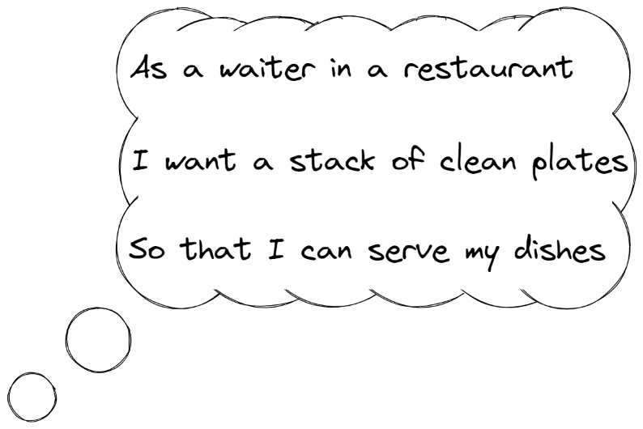
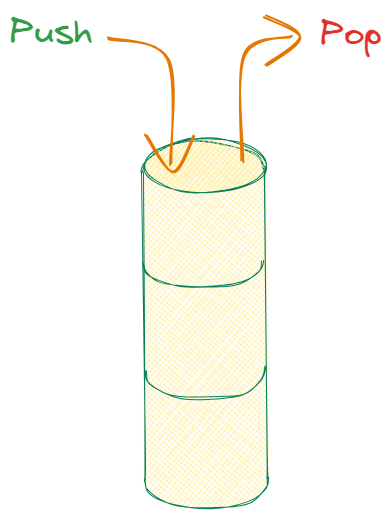

# Goal

Test-driven development (TDD) can be explained relatively easily. At the same time, TDD turns out to be a skill that can only be properly acquired by practicing it. This step-by-step guide aims to do exactly that: get you acquainted with TDD by applying its practices to a somewhat academic example. This academic example ensures that you won't be distracted by other challenges. These additional challenges can be addressed in other katas. 

## What you will learn

You will learn to:

1. Effectively and strictly apply TDD, i.e. writing tests for each and every line of code.
2. To use code coverage effectively (i.e. always reaching 100%).
3. That TDD and BDD are in fact _very closely_ related.
4. To work in _tiny_ increments.
5. Experience the joy every time the tests are green (again)!

# The exercise

The idea of this first exercise is to leave the participant intentionally little to no room to deviate from the described steps. This means you may feel a bit "micro-managed" at times. The idea is to rub the right practices in this way. In subsequent exercises, more elbow room will be given step by step.

## User story to be implemented

The example we will implement is based on an idea of [Uncle Bob's lesson 4](https://www.youtube.com/watch?v=58jGpV2Cg50):

**Figure 1**: _The user story used for this exercise._

## Planning our work

According to Kent Beck again, let's first make a plan/TODO list of how to implement such a user story:

1. Start with an empty stack
2. Define pop on an empty stack
3. Define push on an empty stack
4. Define pop on a non-empty stack
5. Define multiple pushes and pops

**Figure 2**: _Implementing a stack with TDD, based on an idea of [Uncle Bob](https://www.youtube.com/watch?v=58jGpV2Cg50)'s lesson 4._

## Writing our tests... uhm, I mean specifications!

When practicing TDD, you make a mind switch from writing tests to
writing (executable) specifications. In other words, we [specify the
behaviour](https://www.youtube.com/watch?v=Bq_oz7nCNUA) that we would like our
system to exhibit. An [RSpec](https://rspec.info/)-like syntax helps us to do
so, and so we will work with an appropriate framework for each language, e.g.
[Mamba](https://mamba-bdd.readthedocs.io/en/latest/) offers us such an
equivalent for Python.
