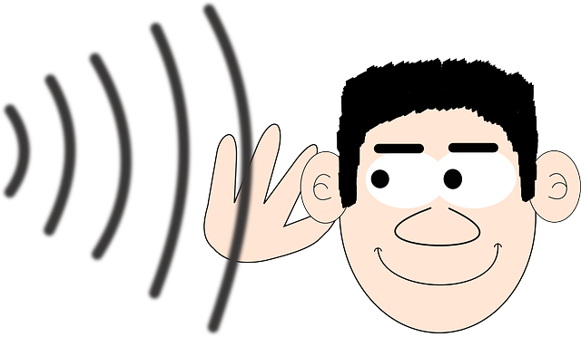

# Tell Don't Ask Kata

This kata focuses on refactoring legacy code, legacy code that violates the [tell don't ask](https://pragprog.com/articles/tell-dont-ask) principle. 
This type of code/domain model is also known as the [anemic domain model](https://martinfowler.com/bliki/AnemicDomainModel.html).

This is a fork of the original Tell Don't Ask Kata by [@rachelcarmena](https://github.com/rachelcarmena/tell-dont-ask-kata) in Java. 
You'll also find ports to other languages in this directory. 

## Instructions
This kata consists of a simple order flow application. 
It's able to create orders, do some calculations (totals and taxes), and manage them (approval/rejection and shipping).

The old development team did not find the time to build a proper domain model, preferring instead to use a procedural style and build this anemic domain model.
Fortunately, they at least took the time to write unit tests for the code.

Your new CTO, after many bugs caused by this application, has asked you to refactor this code to make it more maintainable and reliable.

## What to focus on

As the title of the kata suggests, the aim is of course to familiarise yourself with the tell-don't-ask principle.
Eventually, you should be able to remove all the setters from the domain objects by moving the behavior into those very domain objects.

But don't stop there.

If you can remove some test cases because they don't make sense anymore, feel free to do so!
