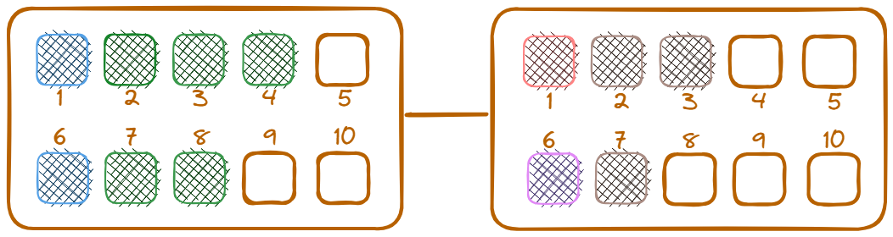

# Train reservation kata

The assignment in this kata is to build a reservation system for
train tickets based on a set of business rules.

## Goal

The emphasis in this kata is on practicing/getting acquainted with 
[double-loop TDD](https://sammancoaching.org/learning_hours/bdd/double_loop_tdd.html)
using example mapping as a means to formulate the test(s) in the outer loop.

## Business Rules

The user story is pretty straightforward:

> *As* a passenger
> *I want to* book a train ticket in advance
> *so that* I can count on it with my planning.

When facilitating the example mapping workshop, you can choose between
a couple of different approaches/profiles.

### Profile 1: The One With Last-Minute Bookings

- 3 rules are introduced at the same time. 
  ⇒ All seats for one reservation in the same coach.  
  ⇒ Max 70% of the entire train. 
  ⇒ Ideally, max 70% of each coach.
- We want to keep seats for last-minute bookings because they are valuable (10% more expensive).
- We want to distribute bookings for security reasons.

### Profile 2: The One With Hidden Discounts

- 3 rules introduced one by one. 
  ⇒ All seats for one reservation in the same coach. 
  ⇒ Max 70% of the entire train. 
  ⇒ Ideally, max 70% of each coach.
- We want to keep seats for last-minute bookings because they are valuable (10% more expensive).
- At most 8 seats per reservation because you benefit from a 5% discount starting from 6 seats per reservation.

### Profile 3: The One With Overbooking

- No rules are introduced at all. There is only one sketched example illustrating the following rule: 
  ⇒ All seats for one reservation in the same coach.
- We don’t care about the distribution of bookings across the train.
- We accept overbooking as you don’t need to have a seat to take the train!

### Profile 4: The One With High-Comfort Standards

- No rules are introduced at all. There is only one sketched example illustrating the following rule: 
  ⇒ All seats for one reservation in the same coach.
- We don’t care about the distribution of bookings across the train.
- We refuse overbooking as we have high comfort standards.
- You can choose specific locations across the train (window, aisle, duo).

The size nor the layout of the coaches is given, but a typical layout
could look like this:

## Considerations

Consider the following scenarios

- Booking when less than 70% occupancy is inevitable
- Booking for single persons
- Booking for multiple persons
- Same coach reservation
- Multiple coach reservation
- Conflicts

## Train Reservation References

- Based on the instructions and code found in the [repo of Emily Bache](https://github.com/emilybache/KataTrainReservation/tree/master#readme)
- Modeling the train reservation kata
  [part 1](https://sadraskol.com/posts/modeling-the-train-reservation-kata-part-1/) and
  [part 2](https://sadraskol.com/posts/modeling-the-train-reservation-kata-part-2/)

# Introduction Example mapping

The image below is based on the [Scrumblr](http://scrumblr.ca/) board running in 
[this replit repository](https://scrumblr.zwh.repl.co/Example%20mapping). 
If you're entering from the main page, the board is called "Example mapping".

## Example mapping References
- [How we do Example Mapping at Harver](https://www.linkedin.com/pulse/how-we-do-example-mapping-harver-phil-mander/)
- [Introduction video](https://www.youtube.com/watch?v=VwvrGfWmG_U) to example mapping
- Short [blog post](https://cucumber.io/blog/bdd/example-mapping-introduction/)
- [Prepared online board](https://scrumblr.zwh.repl.co/Example%20mapping) that can be used
